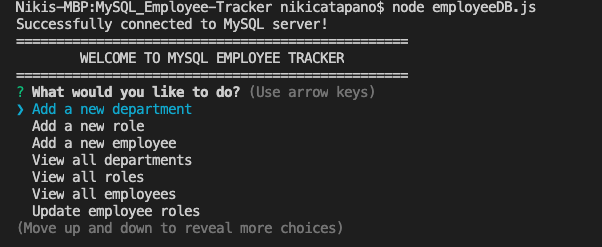
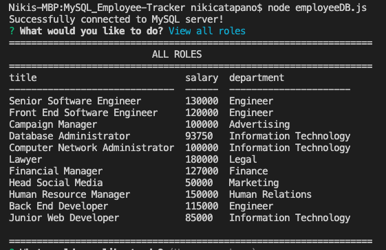
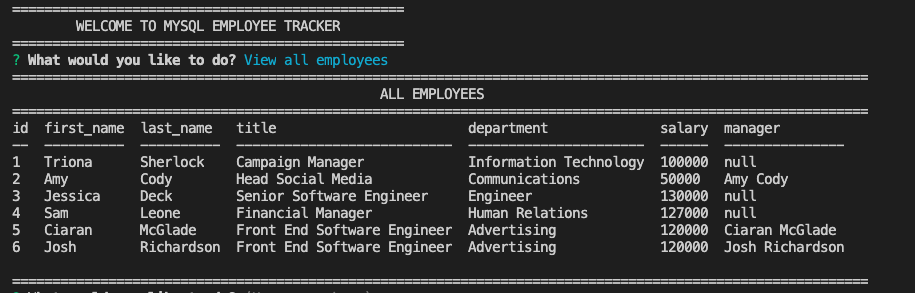
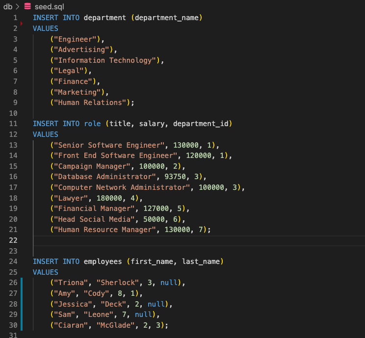

# MySQL_Employee-Tracker

## Description

This is a CLI-based application which is aimed to help companies keep track of their employees, departments and roles of a large company. This uses the MySQL Database "EmployeeTrackerDB", Inquirer, and console.table() which allows the user to insert, view, modify, update, and data within the EmployeeTrackerDB database with his inside the MySQL. This application allows for an employee to be updated providing a list to choose from the current employees, ability to select a new role, and also change and update their manager if needed. Some employees are the manager so there is a "none" option at the bottom if no manager is needed.  

## Table of Contents

- [Demonstration](#demonstration)
- [Installation](#installation)
- [Usage](#usage)
- [License](#license)
- [Contribution](#contribution)
- [Technologies](#technologies)
- [Questions](#questions)

## Demonstration

### Main Menu

### View All Roles

### View All Employees

### Seed To Occupy DB

### Demonstration Gif

[Click here to view the full demo!](https://drive.google.com/file/d/1UnpD8go-dUUZUuwJR6agj0hCmEXqLyvU/view)

## Installation

To install, the user can clone this repository to their personal computer and then install the dependencies listed below.
The user must then make sure they have a visual database such as MySQL Workbench as used for this project. 
The user will insert the Schema and Seed file to create the database, tables, and use the seed.sql to occupy the database.

The following dependencies are required to be installed for this application to run properly:

      npm i
      npm install mysql
      npm i console.table

## Usage

Once all dependencies have been installed, please follow the directions below in order to run this app:

Run this application in the terminal by running `node server.js` command and will begin prompting user to answer questions/select what they want to do.

## License

This application is licensed under the MIT License.

## Contribution

This project was creating with help from:

- Provided material from: BootCamp Spot class
- My tutor [Eric Wallen](https://github.com/ericwallen)
- Help from other students in the class in a private study group.

## Technologies

- [Visual Studio Code](https://code.visualstudio.com/)
- [Node.js](https://nodejs.org/en/)
- [MySQL](https://dev.mysql.com/)
- [MySQL Workbench](https://dev.mysql.com/downloads/workbench/)
- Terminal / Git Bash

## Questions

For any other questions about this project, please visit my GitHub page: [GitHub Profile](https://github.com/nsc9605/MySQL_Employee-Tracker).

Or you can email me directly at: [Nicole Catapano](mailto:nsc9605@gmail.com).
